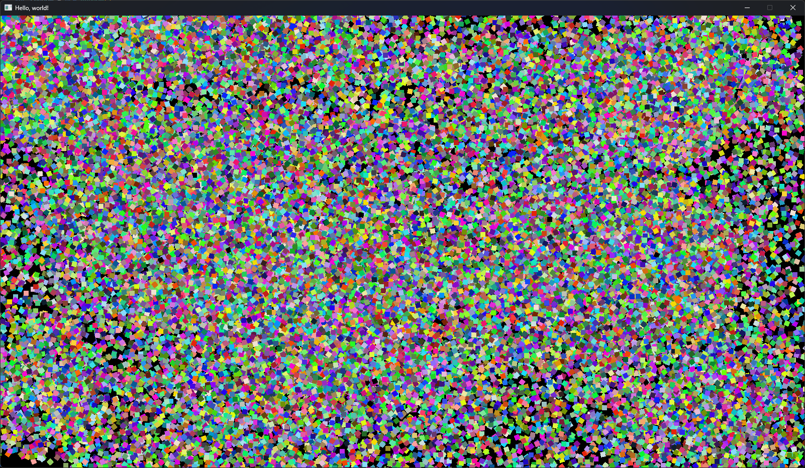

# Velvet

heavily unfinished library

you can make games, tools, whatever

tbh idk if i'll finish this i'll just put this here for progress, if anyone wants to help out please do i am not great at C# :sob:

## things i'm done with

- basic window
- drawing rectangles, circles, any polygon you could think of, with color!
- input from keyboard and mouse

Stress Test, ~25 FPS with ~200,000 rectangles

## how to test

### windows

all you gotta do is

    git clone https://github.com/taxevaiden/Velvet.git

cd into the cloned repo and do

    dotnet restore

it should *just* work. at least from my experience.

### linux 

first, do

    git clone https://github.com/taxevaiden/Velvet.git

cd into the cloned repo and do

    dotnet restore

now, don't try to test just yet. if you do it'll whine about SDL3 missing, since it is. you'll need to get `libSDL3.so` by compiling SDL3 from source. or at least that's what i did, i'm not writing the whole thing here. 

if you do manage to compile SDL3, it should work.

### macOS

first, do

    git clone https://github.com/taxevaiden/Velvet.git

cd into the cloned repo and do

    dotnet restore

again, just like linux, it will say "SDL3 missing." you can install SDL3 via Homebrew:

    brew install sdl3

it won't work just yet, something about not looking in the directory where libSDL3.dylib is and therefore not being able to find it. i did manage to get it working though:

    export DYLD_LIBRARY_PATH=/opt/homebrew/lib:$DYLD_LIBRARY_PATH
    dotnet run

> [!WARNING]
> this only works on Apple Silicon macs. using `brew install sdl3` on an Intel mac installs `libSDL3.dylib` somewhere else. i forgot where though. if you do remember, change the path of `export DYLD_LIBRARY_PATH=/opt/homebrew/lib:$DYLD_LIBRARY_PATH` to where ever it is.

however, you won't be able to test this in VSCode (or anywhere else)

you will only be able to test using the terminal. i'll eventually fix this in the future