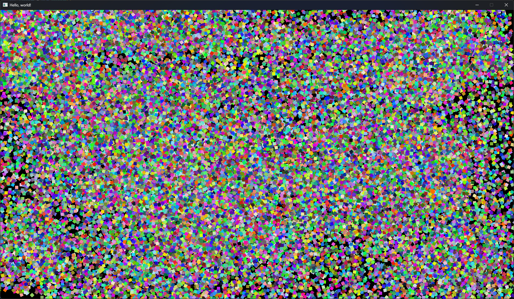

# Velvet

a heavily unfinished framework for .NET 10. you can make games, tools, whatever.

there are better frameworks out there that do a lot more than this, like [Bliss](https://github.com/MrScautHD/Bliss). velvet was made for fun and to learn more about how graphics and rendering work.

---

## getting started

getting a window open is as easy as:

```csharp
// Game.cs
namespace MyGame
{
    class Game : VelvetApplication
    {
        public Game(int width = 1600, int height = 900, string title = "Hello, world!")
            : base(width, height, title)
        {}
    }
}
```

```csharp
// Program.cs
namespace MyGame
{
    class Program
    {
        static void Main(string[] args)
        {
            var game = new Game();
            game.Run(args.Length, args);
        }
    }
}
```

and you have a window! `Window` and `Renderer` are exposed to whatever class you derive from `VelvetApplication`, so you can do anything you want from there.

here's a more complete example using a texture, a custom shader, and uniforms:

```csharp
// Game.cs
protected override void OnInit()
{
    base.OnInit();
    stopwatch = new();
    usagi     = new VelvetTexture(Renderer, "assets/usagi.jpg");
    testShader = new VelvetShader(
        Renderer,
        "assets/shaders/shader.vert",
        null,
        [new UniformDescription("time", UniformType.Float, UniformStage.Vertex)]
    );
    testShader.Set("time", 0.0f);
    testShader.Flush();
    stopwatch.Start();
}

protected override void Update(float deltaTime)
{
    testShader.Set("time", stopwatch.ElapsedMilliseconds / 100.0f);
    testShader.Flush();
}

protected override void Draw()
{
    Renderer.Begin();
    Renderer.ClearColor(Color.White);
    Renderer.ApplyTexture(usagi);
    Renderer.ApplyShader(testShader);
    Renderer.DrawRectangle(
        new Vector2(50.0f, 50.0f),
        new Vector2(Window.Width - 100.0f, Window.Height - 100.0f),
        Color.White
    );
    Renderer.End();
}

protected override void OnShutdown()
{
    base.OnShutdown();
    stopwatch.Stop();
    usagi.Dispose();
    testShader.Dispose();
}
```

```glsl
// shader.vert
#version 450

layout(location = 0) in vec2 Position;
layout(location = 1) in vec2 UV;
layout(location = 2) in vec4 Color;

layout(location = 0) out vec2 fsin_UV;
layout(location = 1) out vec4 fsin_Color;

layout(set = 0, binding = 2) uniform Globals
{
    float time;
};

void main()
{
    vec2 pos = vec2(Position.x, Position.y + sin(Position.x * 100.0f + time) * 0.1f);
    gl_Position = vec4(pos, 0.0, 1.0);
    fsin_UV    = UV;
    fsin_Color = Color;
}
```

more examples can be found in `Velvet.Tests`.

---

## what's done

- basic window
- drawing rectangles, circles, and arbitrary polygons with color
- textures
- shaders with uniform support
- render textures
  - multisampling supported
  - known issue: drawing a `VelvetTexture` to a multisampled `VelvetRenderTexture` does nothing on the OpenGL backend. this works fine on Vulkan and D3D11.
  - known issue: OpenGL flips texture samples across the x-axis when drawing to a `VelvetRenderTexture`. regular `VelvetTexture`s are unaffected. to compensate, Velvet automatically flips UVs when rendering to a render texture on OpenGL. keep this in mind when writing shader code!
- keyboard and mouse input
- all four major graphics APIs
  - D3D11
  - Vulkan
  - Metal
  - OpenGL

---



*~60 FPS with ~100,000 rectangles*

---

## running locally

```sh
git clone https://github.com/taxevaiden/Velvet.git
cd Velvet
dotnet restore
dotnet run
```